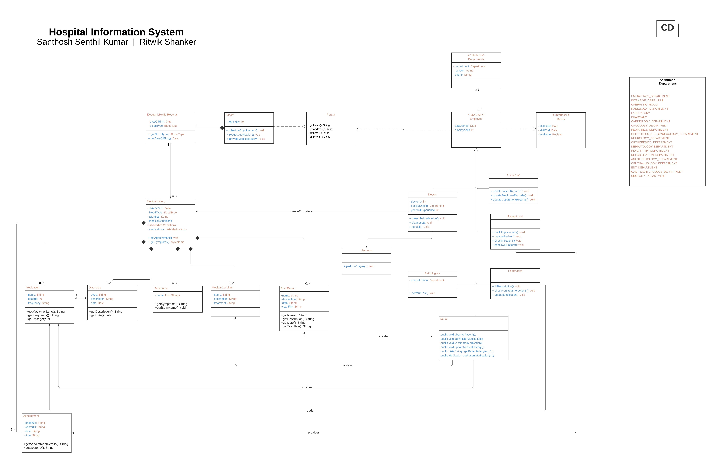

# HIS

# Models and Documentation

In this section, we present the models developed for the hospital information system using Monticore, a domain-specific modeling language and toolset, as well as Business Process Model and Notation (BPMN) diagrams. The models serve as visual representations of the system's structure, behavior, and interactions, offering stakeholders a comprehensive understanding of the various components and functionalities of the hospital information system.

## Class Diagrams




### Patient

The `Patient` class represents a patient in a healthcare system. It extends the `Person` class and adds additional attributes specific to patients. The `Person` class contains common attributes such as ID, name, address, email, and phone.

The `Patient` class has the following operations:

-   `scheduleAppointment()`: Allows the patient to schedule an appointment.

-   `requestMedication()`: Allows the patient to request medication.

-   `provideMedicalHistory()`: Allows the patient to provide their medical history.

The `Patient` class has a composition relationship with the `MedicalHistory` class, indicating that each patient has a medical history. This relationship is denoted by the arrow connecting `Patient` to `MedicalHistory` with a multiplicity of `[*]`, meaning each patient can have multiple medical history records.

```
//package com.his.patient;

import EHR.MedicalHistory;

classdiagram Patient {

    class Person {
        int id;
        String name;
        String address;
        String email;
        String phone;
    }

    class Patient extends Person {
        int patientId;
        
        public void scheduleAppointment();
        public void requestMedication();
        public void provideMedicalHistory();
    }

    composition Patient -> MedicalHistory [*];
}

```

### Hospital

The `Hospital` class has the following nested classes:

-   `Departments`: Represents a department in the hospital. It has attributes such as the department name, location, and phone number.

-   `Receptionist`, `Nurse`, `Pharmacist`, `AdminStaff`, `Pathologists`, `Doctor`, and `Surgeon`: These classes represent different types of employees in the hospital. They extend the `Employee` class, which itself extends the `Person` class. Each employee class has specific operations related to their role in the hospital.

The `Hospital` class also has an enumeration called `Department`, which lists various departments in the hospital.

There are associations between the classes:

-   `Employee` has a composition relationship with `Duties`, indicating that each employee has one or more duties.

-   `AdminStaff` has a supervision relationship with other employees, denoted by the association between `AdminStaff` and `Employee`.

-   `Doctor` has a relationship with `Departments`, indicating that each doctor can head a department, and each department can have a head doctor.

-   `Employee` has a relationship with `Departments`, indicating that each employee works in one department.


```
//package com.his.hospital;

import java.util.Date;
import Patient.Person;

classdiagram Hospital {

    enum Department {
        EMERGENCY_DEPARTMENT,INTENSIVE_CARE_UNIT,OPERATING_ROOM,
        RADIOLOGY_DEPARTMENT,LABORATORY,PHARMACY,CARDIOLOGY_DEPARTMENT,
        ONCOLOGY_DEPARTMENT,PEDIATRICS_DEPARTMENT,OBSTETRICS_AND_GYNECOLOGY_DEPARTMENT,
        NEUROLOGY_DEPARTMENT,ORTHOPEDICS_DEPARTMENT,DERMATOLOGY_DEPARTMENT,PSYCHIATRY_DEPARTMENT,
        REHABILITATION_DEPARTMENT,ANESTHESIOLOGY_DEPARTMENT,OPHTHALMOLOGY_DEPARTMENT,
        ENT_DEPARTMENT,GASTROENTEROLOGY_DEPARTMENT,UROLOGY_DEPARTMENT;
    }

    class Departments {
        Department department;
        String location;
        String phone;
    }

    package hospital.staff {

        class Duties {
            Date shiftStart;
            Date shiftEnd;
            boolean available;
        }

        abstract class Employee extends Person {
            Date dateJoined;
            int employeeID;
        }

        composition [1] Employee (duties) <-> (duties) Duties [1..*];

        class Receptionist extends Employee {
            public void bookAppointment();
            public void registerPatient();
            public void checkInPatient();
            public void checkOutPatient();
        }

        class Nurse extends Employee {
            public void checkVitalSigns();
            public void administerMedication();
            public void updateMedicalHistory();
        }

        class Pharmacist extends Employee {
            public void fillPrescription();
            public void checkForDrugInteractions();
            public void updateMedication();
        }

        class AdminStaff extends Employee {
            public void updatePatientRecords();
            public void updateEmployeeRecords();
            public void updateDepartmentRecords();
        }

        class Pathologists extends Employee {
            public void performTest();
        }

        class Doctor extends Employee {
            int doctorID;
            String specialization;
            int yearsOfExperience;
            public void prescribeMedication();
            public void diagnose();
        }

        class Surgeon extends Doctor {
            public void performSurgery();
        }

        association [1] AdminStaff (supervisedBy) <-> (supervises) Employee [1..*];
        association [1] Doctor (head) <-> (heads) Departments [0..1];
        association [1..*] Employee <-> (worksAt) Departments [0..1];
  }
}
```

### Electronic Health Record

The `EHR` class represents an Electronic Health Record (EHR) system. It contains several classes related to medical information.

The `EHR` class has the following nested classes:

-   `Symptoms`: Represents a list of symptoms.

-   `Diagnosis`: Represents a medical diagnosis with attributes such as code, description, date, and associated symptoms.

-   `ScanReport`: Represents a scan report with attributes such as name, description, date, and the file containing the scan.

-   `Appointment`: Represents a scheduled appointment with attributes such as patient ID, doctor ID, date, and time.

-   `Medication`: Represents a medication with attributes such as name, dosage, and frequency.

-   `MedicalCondition`: Represents a medical condition with attributes such as name, description, and treatment. The treatment attribute within the MedicalCondition class allows for the inclusion of information related to the recommended or prescribed procedures, medications, therapies, or lifestyle modifications that are commonly associated with managing or treating that specific medical condition.

The `MedicalHistory` class is an abstract class representing the medical history of a patient. It contains attributes and relationships to various medical components such as allergies, medical conditions, medications, diagnoses, symptoms, scan reports, and appointments.

There are composition relationships between `MedicalHistory` and each of the medical components, indicating that a medical history consists of multiple instances of these components.

The `ElectronicHealthRecord` class represents an electronic health record for a patient. It contains attributes such as date of birth and blood type. It has a composition relationship with `MedicalHistory`, indicating that an electronic health record includes a patient's medical history.


```
//package com.his.ehr;

import java.util.Date;

classdiagram EHR {
    
    class Symptoms {
        private List<String> name;
    }

    class Diagnosis {
        private String code;
        private String description;
        private List<Symptoms> symptoms;
        private String date;
    }

    class ScanReport {
        private String name;
        private String description;
        private String date;
        private String scanFile;
    }

    class Appointment {
        private String patientId;
        private String doctorID;
        private String date;
        private String time;
    }

    class Medication {
        private String name;
        private int dosage;
        private String frequency;
    }

    class MedicalCondition {
        private String name;
        private String description;
        private String treatment;
    }

    association [1] MedicalCondition -> (treatedBy) Medication [1..*];

    enum BloodType {
        A_POSITIVE,A_NEGATIVE,B_POSITIVE,B_NEGATIVE,AB_POSITIVE,AB_NEGATIVE,O_POSITIVE,O_NEGATIVE;
    }

    class MedicalHistory {
        protected List<String> allergies;
        public List<String> getAllergies();
    }

    composition MedicalHistory -> MedicalCondition [*];
    composition MedicalHistory -> Medication [*];
    composition MedicalHistory -> Diagnosis [*];
    composition MedicalHistory -> Symptoms [*];
    composition MedicalHistory -> ScanReport [*];
    composition MedicalHistory -> Appointment [*];

    class ElectronicHealthRecord {
        protected Date dateOfBirth;
        protected BloodType bloodType;

        public BloodType getBloodType();
        public Date getDateOfBirth();
    } 
    
    composition ElectronicHealthRecord -> MedicalHistory [*];
    
}

```


## Sequence Diagrams

### Patient Scan

The sequence diagram illustrates the interaction between a patient (`pt`), a doctor (`d`), an electronic health record (`ehr`), and a pathologist (`plg`) during a scanning process.

1.  The patient initiates the `consultdoctor()` operation with the doctor.

2.  The doctor retrieves the patient's health record from the electronic health record (`ehr`) using the `getHealthRecord(pt)` operation.

3.  The electronic health record returns the medical history (`medHistory`) to the doctor.

4.  The doctor verifies if a scan is required by checking the `scanRequired` attribute of the medical history. If it is true, the process continues; otherwise, the doctor provides advice to the patient and the sequence ends.

5.  The doctor informs the patient of their advice using the `return advice` operation.

6.  The patient requests the pathologist (`plg`) to get scanned by invoking the `getScanned()` operation.

7.  The pathologist creates a scan report (`scanReport`) and sends it to the electronic health record using the `createScanReport(scanReport)` operation.

8.  The electronic health record receives the scan report and acknowledges the pathologist.

9.  The electronic health record notifies the doctor about the scan report using the `notifyDoctor(scanReport)` operation.

10. The doctor reviews the scan report using the `reviewReport()` operation.

11. The doctor consults with the patient using the `consult()` operation.

12. The patient responds to the doctor's consultation.

13. The doctor updates the medical history in the electronic health record using the `addHistory()` operation.


```
sequencediagram Vaccination {

  pt:Patient;
  d:Doctor;
  ehr:ElectronicHealthRecord;
  plg:Pathologist;

    pt -> d : consultdoctor() {
        d -> ehr : getHealthRecord(pt) {
            ehr -> d : return medHistory;
        }

        assert medHistory.scanRequired == True;

        d -> pt :return advice;
    }

    pt -> plg : getScanned() {
        plg -> ehr : createScanReport(scanReport) {
            ehr -> plg : return;
        } 

        ehr -> d : notifyDoctor(scanReport) {
            d -> ehr : return;
        }

        d -> ehr : reviewReport() {
            ehr -> d : return;
        }

        d -> pt : consult() {
            pt -> d : return;
        }
        
        d -> ehr : addHistory() {
            ehr -> d : return;
        }

    }
}
```


### Vaccination

The sequence diagram depicts the interaction between a patient (`p1`), a nurse (`nu1`), and an electronic health record (`ehr`) during a vaccination process that involves checking for allergies and using anti allergant along with the vaccine. This has been broken down into two parts, one for patient without allergies and one for with allergies.

### Vaccination of patient without allergies

The sequence of events is as follows:

1.  The patient arrives at the hospital and initiates the `arriveToHospital()` operation with the nurse.

2.  The nurse retrieves the patient's allergies from the electronic health record using the `getAllergies(p1)` operation.

3.  The electronic health record returns no allergies to the nurse.

4.  The nurse administers the vaccination to the patient.

5.  The nurse observes the patient and initiates the `ObservePatient()` operation.

6.  The nurse updates the patient's medical history in the electronic health record using the `UpdateMedicalHistory()` operation.

7.  The patient responds to the nurse's observation.

```
sequencediagram Vaccination {

  p1:Patient;
  nu1:Nurse;
  ehr:ElectronicHealthRecord;

  p1 -> nu1 : arriveToHospital() {
    nu1 -> ehr : getAllergies(p1) {
      ehr -> nu1 : return allergies;
    }

    assert allergies == null;

    nu1 -> p1 : vaccinate() {
      p1 -> nu1 : return;
    }

    nu1 -> p1 : ObservePatient() {
      nu1 -> ehr : UpdateMedicalHistory() {
        ehr -> nu1 : return;
      }
      p1 -> nu1 : return;
    }
  }
}
```


### Vaccination of patient with allergies

1.  The patient arrives at the hospital and initiates the `arriveToHospital()` operation with the nurse.

2.  The nurse retrieves the patient's allergies from the electronic health record using the `getAllergies(p1)` operation.

3.  The electronic health record returns the allergies to the nurse.

4.  The nurse retrieves the patient's medication history (`mc1`) from the electronic health record using the `getMedication(p1)` operation.

5.  The electronic health record returns the medication history to the nurse.

6.  The nurse checks for an anti-allergen (`antiAllergent`) based on the medication history.

7.  The nurse administers the vaccination to the patient, taking into account the anti-allergen.

8.  The nurse observes the patient and initiates the `ObservePatient()` operation.

9.  The nurse updates the patient's medical history in the electronic health record using the `UpdateMedicalHistory()` operation.

10. The patient responds to the nurse's observation.


```
sequencediagram Vaccination {

  p1:Patient;
  nu1:Nurse;
  ehr:ElectronicHealthRecord;

  p1 -> nu1 : arriveToHospital() {
    nu1 -> ehr : getAllergies(p1) {
      ehr -> nu1 : return allergies;
    }

    assert allergies != null;

    nu1 -> ehr : getMedication(p1) {
      ehr -> nu1 : return mc1;
    }

    nu1 -> nu1 : getAntiAllergent(mc1) {
      nu1 -> nu1 : return antiAllergent;
    }

    nu1 -> p1 : vaccinate(antiAllergent) {
      p1 -> nu1 : return;
    }

    nu1 -> p1 : ObservePatient() {
      nu1 -> ehr : UpdateMedicalHistory() {
        ehr -> nu1 : return;
      }
      p1 -> nu1 : return;
    }
  }
}

```


## Use Case Diagram

### Reception and Patient UCD

This use case diagram illustrates the various interactions and functionalities between a receptionist and a patient in the hospital information system.

**Use Cases**

-   ScheduleAppointment: This use case allows the receptionist and the patient to schedule an appointment for a specific date and time.

-   ScheduleHospitalAdmission: The receptionist and the patient can use this use case to schedule a hospital admission for the patient.

-   PatientRegistration: This use case enables the receptionist and the patient to complete the patient registration process.

-   PatientHospitalAdmission: The receptionist can initiate the patient's hospital admission process using this use case.

-   FileMedicalReports: The receptionist can use this use case to file and manage the patient's medical reports.

**Actors**

-   Receptionist: Represents the hospital receptionist who interacts with the patient and performs administrative tasks.

-   Patient: Represents the individual seeking medical care from the hospital.

**Relationships**

-   The Receptionist actor is associated with several use cases, including ScheduleAppointment, ScheduleHospitalAdmission, PatientRegistration, PatientHospitalAdmission, and FileMedicalReports.

-   The Patient actor is associated with ScheduleAppointment, ScheduleHospitalAdmission, and PatientRegistration.

-   PatientRegistration extends both ScheduleHospitalAdmission and ScheduleAppointment, indicating that patient registration involves scheduling hospital admissions and appointments.

-   PatientHospitalAdmission includes PatientRegistration, indicating that the patient's hospital admission process includes patient registration.

-   NewPatientHospitalAdmission specializes PatientHospitalAdmission, indicating a specific type of patient hospital admission for new patients.

-   InHospitalPatientAdmission specializes PatientHospitalAdmission, representing the hospital admission process for existing inpatients.

-   Both NewPatientHospitalAdmission and InHospitalPatientAdmission include BedAllotment, indicating that bed allotment is part of the respective admission processes.


```
usecasediagram Receptionist_Patient {
  @Receptionist --
    ScheduleAppointment,
    ScheduleHospitalAdmission,
    PatientRegistration,
    PatientHospitalAdmission,
    FileMedicalReports;

  @Patient --
    ScheduleAppointment,
    ScheduleHospitalAdmission,
    PatientRegistration;

  PatientRegistration extend ScheduleHospitalAdmission;
  PatientRegistration extend ScheduleAppointment;
  PatientHospitalAdmission include PatientRegistration;

  NewPatientHospitalAdmission specializes PatientHospitalAdmission;
  InHospitalPatientAdmission specializes PatientHospitalAdmission;

  NewPatientHospitalAdmission include BedAllotment;
  InHospitalPatientAdmission include BedAllotment;
}
```


### Dischage Patient UCD

This use case diagram illustrates the interactions and functionalities related to the discharge of a patient from a hospital in the hospital information system.

**Use Cases**

-   DischargePatient: Represents the use case where the receptionist performs the patient discharge process.

-   GenerateBill: This use case extends the ViewEHRs use case and involves generating the patient's bill as part of the discharge process.

**Actors**

-   Receptionist: Represents the hospital receptionist who is responsible for initiating and managing the discharge process.

**Relationships**

-   The Receptionist actor is associated with the DischargePatient use case, indicating that the receptionist is responsible for performing the patient discharge process.

-   GenerateBill extends the ViewEHRs use case, indicating that generating the patient's bill is an additional step within the discharge process.

-   DischargePatient includes the GenerateBill use case, indicating that generating the bill is a part of the overall discharge process.

-   DischargeOutPatient specializes the DischargePatient use case, representing the discharge process for patients who were treated as outpatients.

-   DischargeInPatient specializes the DischargePatient use case, representing the discharge process for patients who were admitted to the hospital as inpatients.

```
usecasediagram DischargePatient {
  @Receptionist --
    DischargePatient;


  GenerateBill extends ViewEHRs
  DischargePatient includes GenerateBill
  DischargeOutPatient specializes DischargePatient;
  DischargeInPatient specializes DischargePatient;
}

```


### Doctor Patient Interaction with EHR Use Case

This use case diagram illustrates the interactions and functionalities of the Electronic Health Record (EHR) system within the hospital information system. It captures the use cases involving doctors and patients in accessing and managing medical information.

**Use Cases**

-   ViewMedicalHistory: This use case allows doctors and patients to view the medical history of the patient.

-   AddDiagnosis: Doctors can use this use case to add a diagnosis to a patient's medical record.

-   PrescribeMedication: Doctors can prescribe medication to patients using this use case.

-   ScheduleAppointment: Patients can schedule an appointment using this use case.

-   RequestMedication: Patients can request medication through this use case.

-   ProvideMedicalHistory: Patients can provide their medical history using this use case.

**Actors**

-   Doctor: Represents the medical professional responsible for diagnosing and treating patients.

-   Patient: Represents an individual seeking medical care from the hospital.

**Relationships**

-   The Doctor actor is associated with ViewMedicalHistory, AddDiagnosis, and PrescribeMedication use cases, indicating the functionalities available to doctors.

-   The Patient actor is associated with ViewMedicalHistory, ScheduleAppointment, RequestMedication, and ProvideMedicalHistory use cases, representing the functionalities accessible to patients.

-   ViewMedicalHistory extends ProvideMedicalHistory, indicating that the action of viewing the medical history is built upon the patient providing their medical history.

-   PrescribeMedication includes RequestMedication, indicating that prescribing medication includes the request made by the patient.

```
usecasediagram ElectronicHealthRecord {
  @Doctor --
    ViewMedicalHistory,
    AddDiagnosis,
    PrescribeMedication;

  @Patient --
    ViewMedicalHistory,
    ScheduleAppointment,
    RequestMedication,
    ProvideMedicalHistory;

  ViewMedicalHistory extend ProvideMedicalHistory;
  PrescribeMedication include RequestMedication;
}
```


## BPMN Diagram

In the following BPMN model, the process of a doctor scheduling a test is explained:

1.  The doctor in the hospital orders a test.

2.  The receptionist receives the test order and schedules the test.

3.  The receptionist notifies the patient about the scheduled appointment.

4.  An event-based gateway is used to wait for the patient's response.

5.  When the patient responds, it is checked if they want to reschedule the appointment or accept it.

6.  If the patient wants to reschedule the appointment, the process loops back to the scheduling step.

7.  If the appointment is accepted, the pathologist is assigned to perform the test.

8.  The pathologist collects samples for the test and analyzes them.

9.  If the test results are inconclusive, the test is performed again.

10. The pathologist repeats the test until the results are conclusive.

11. The conclusive test result is updated in the system and stored under the patient's electronic health record.

12. The test result is communicated to the doctor.

13. The doctor reviews the test result and updates the patient's health record in the health information system.

14. The doctor notifies the patient about the test result.


